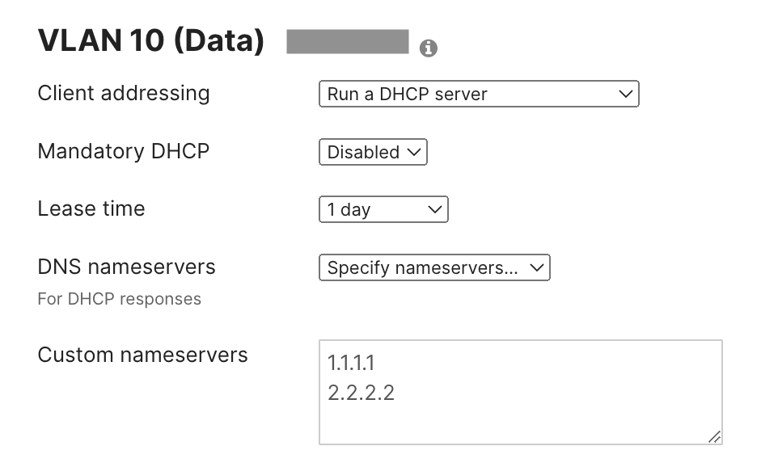
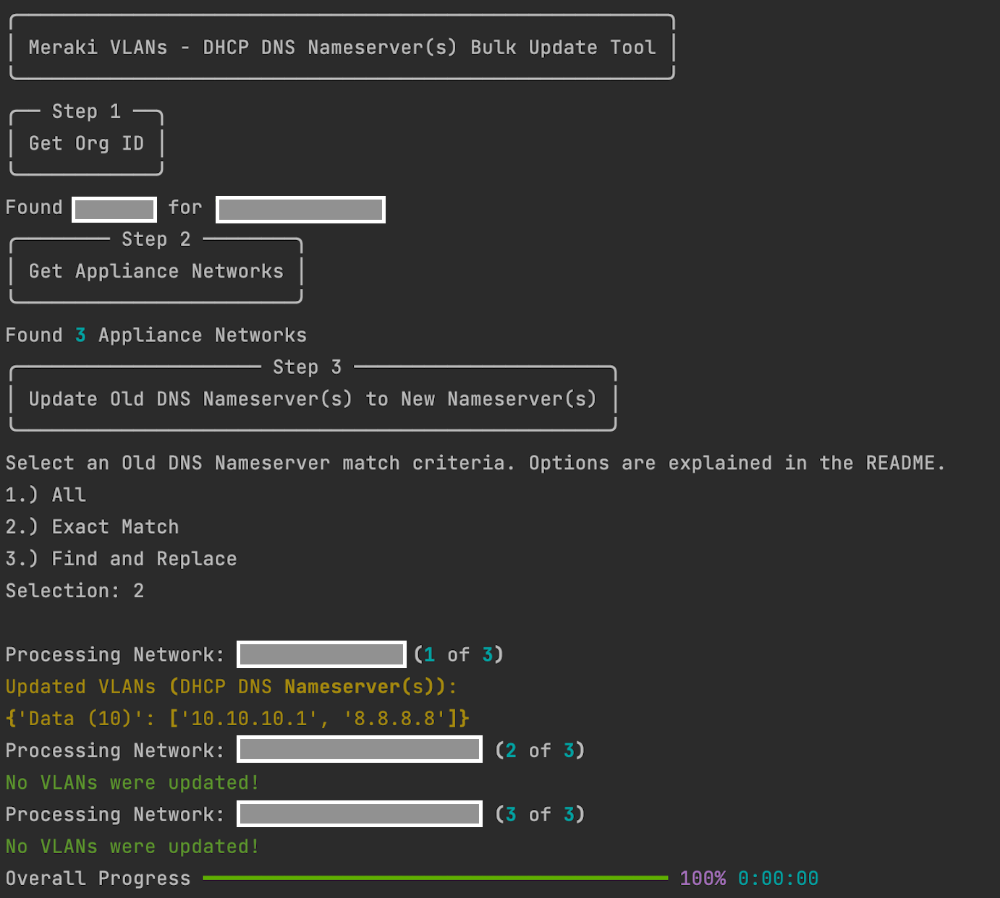
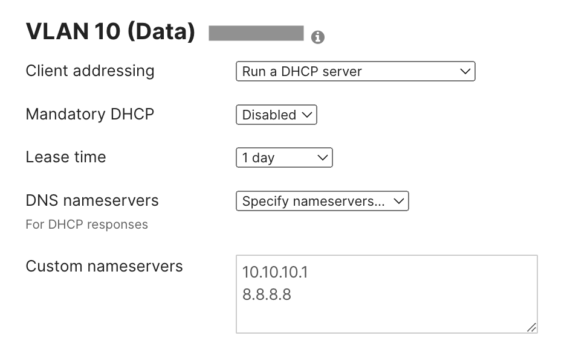

# Meraki VLAN DNS Bulk Update Tool

This script modifies the [DHCP DNS Nameservers](https://documentation.meraki.com/MX/DHCP/Configuring_DNS_Nameservers_for_DHCP) for all VLANs across all appliance networks based on a selected `matching criteria`. The script only considers **MX VLANs** which are running a DHCP Server, have custom DNS Nameservers configured, and meet the matching criteria. For VLAN's which are matched, the script replaces or appends to existing DNS values with new DNS Nameserver values.

Both **IPs** and **Domain Names** are supported.

Supported `matching criteria` (and corresponding behavior) per VLAN include:
1. `All`: Replace (or Append) All DNS Values with a new list of IPs/Domains
2. `Exact Match`: Match explicit list of old DNS Values, replace with a list of new IPs/Domains
3. `Find and Replace`: Match old DNS Values which contain a provided list, remove old values, append new list of IPs/Domains.

The primary use case is replacing old DNS IPs/Domains with updated values.
## Contacts
* Trevor Maco

## Solution Components
* Meraki

## Prerequisites
#### Meraki API Keys
In order to use the Meraki API, you need to enable the API for your organization first. After enabling API access, you can generate an API key. Follow these instructions to enable API access and generate an API key:
1. Login to the Meraki dashboard
2. In the left-hand menu, navigate to `Organization > Settings > Dashboard API access`
3. Click on `Enable access to the Cisco Meraki Dashboard API`
4. Go to `My Profile > API access`
5. Under API access, click on `Generate API key`
6. Save the API key in a safe place. The API key will only be shown once for security purposes, so it is very important to take note of the key then. In case you lose the key, then you have to revoke the key and a generate a new key. Moreover, there is a limit of only two API keys per profile.

> For more information on how to generate an API key, please click [here](https://developer.cisco.com/meraki/api-v1/#!authorization/authorization). 

> Note: You can add your account as Full Organization Admin to your organizations by following the instructions [here](https://documentation.meraki.com/General_Administration/Managing_Dashboard_Access/Managing_Dashboard_Administrators_and_Permissions).

## Installation/Configuration
1. Clone this repository with `git clone [repository name]`
2. Rename the `.env_sample` file to `.env`. Rename `config_sample.py` to `config.py`.
3. Add Meraki API key to environment variable in `.env`.
```dotenv
API_KEY="0F...."
```
4. Add Meraki Org Name to configuration variable in `config.py`. Provide a list of Old DNS values (**matching criteria**) and New DNS values in `config.py`. Depending on selected matching criteria, the old list is used to match VLANs and the new list represents replacement values for the old values. 
```
Ex: Match all VLANs with only DNS values (X.X.X.X, Y.Y.Y.Y) and replace them with (Z.Z.Z.Z) (Explicit match - Option 2)
```
```python
# Meraki API Section
ORG_NAME = "Sample"

# DNS Values
OLD_DHCP_DNS_VALUES = ["X.X.X.X", "Y.Y.Y.Y"]
NEW_DHCP_DNS_VALUES = ["Z.Z.Z.Z"]
```
5. Set up a Python virtual environment. Make sure Python 3 is installed in your environment, and if not, you may download Python [here](https://www.python.org/downloads/). Once Python 3 is installed in your environment, you can activate the virtual environment with the instructions found [here](https://docs.python.org/3/tutorial/venv.html).
6. Install the requirements with `pip3 install -r requirements.txt`

## Usage
To run the program, use the command:
```
$ python3 main.py
```
This will prompt you with several options to define matching criteria (using the old DNS list defined in `config.py`) and (if option 1 [All] is selected) whether to overwrite exisiting values or append the new DNS values. Depending on the selection, the `matching behavior` defined above will apply to all VLANs which meet the criteria.  








### LICENSE

Provided under Cisco Sample Code License, for details see [LICENSE](LICENSE.md)

### CODE_OF_CONDUCT

Our code of conduct is available [here](CODE_OF_CONDUCT.md)

### CONTRIBUTING

See our contributing guidelines [here](CONTRIBUTING.md)

#### DISCLAIMER:
<b>Please note:</b> This script is meant for demo purposes only. All tools/ scripts in this repo are released for use "AS IS" without any warranties of any kind, including, but not limited to their installation, use, or performance. Any use of these scripts and tools is at your own risk. There is no guarantee that they have been through thorough testing in a comparable environment and we are not responsible for any damage or data loss incurred with their use.
You are responsible for reviewing and testing any scripts you run thoroughly before use in any non-testing environment.